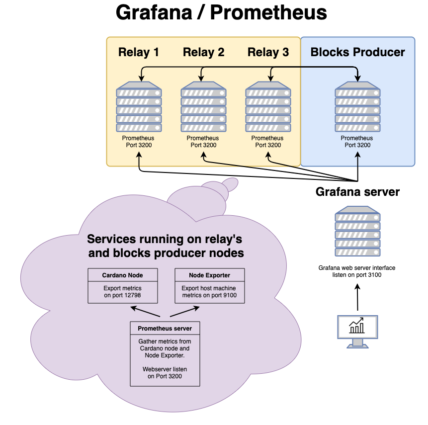

# Monitoring with Grafana

Since it's nice to monitor your setup, follow the Grafana/Prometheus installation step bellow:

The `cardano_monitor` image contain both NodeExporter and Prometheus to run along your node.

To help you understand how all pieces are bound together, here's a small diagram:



### Creating images

1. Set the architecture variable to your requirement (Only amd64 and arm64 supported):

    ```bash 
    ARCHITECTURE=<PROCESSOR_ARCHITECTURE(amd64 or arm64)>
    ```    

2. Build the cardano_monitor image:

        docker build \
            -t cardano_monitor:latest \
            ./Dockerfiles/monitor
            
3. Build the grafana image:

        docker build \
            -t grafana:latest \
            ./Dockerfiles/grafana

### Monitoring tools configuration \*\*OPTIONAL\*\*

Now you've created yours monitoring images, it's time to create your `config` folder.
Your `cardano_monitor` container will bind to this folder, so you can access your configuration from within.

    mkdir config
    cd config

#### Configuration files permissions

Your user living inside your container need to have access to your configuration file. Add public read permission to all your files under `/config`:

    chmod 644 config/*
    
#### Add Grafana configuration file

You can now copy the following config file in this folder:

- [../Dockerfiles/monitor/files/grafana.ini](../Dockerfiles/grafana/files/grafana.ini)

#### Creating the cardano_monitor container

If your not using docker-compose, create the container as follows:

    docker run -dit \
        --network host \
        --name cardano_monitor cardano_monitor:latest

#### Creating the Grafana web server

Since you don't need to run a Grafana web server on every **cardano-node** host, it's container creation isn't included
in the `docker-compose.yml` file. Use the following command to create its container in a location of your choosing.

Go in the same folder where you've created your `config` folder and run the following command:

    docker run -dit \
        --network host \
        --mount source=grafana-data,target=/cardano/grafana/data \
        --mount type=bind,source="$(pwd)"/config,target=/cardano/config,readonly \
        --name grafana grafana:latest

** Tips: Just remove the `bind mount` line if you're good with the provided configuration file.
